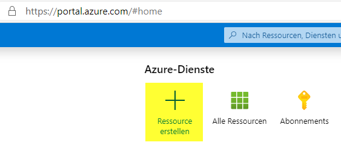
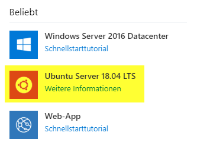
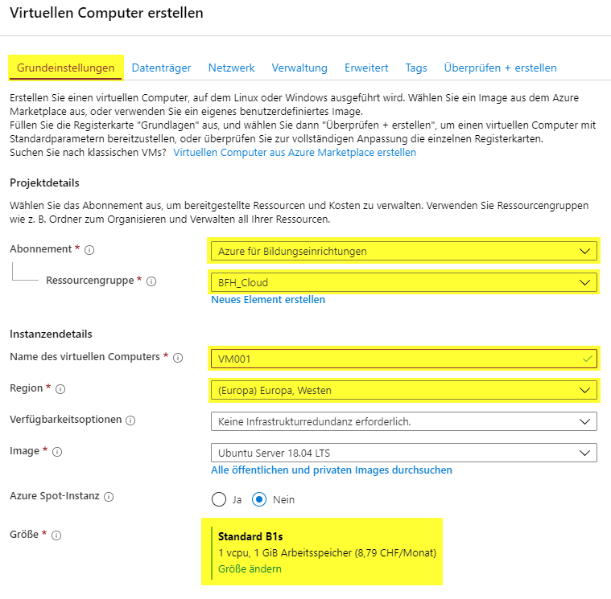
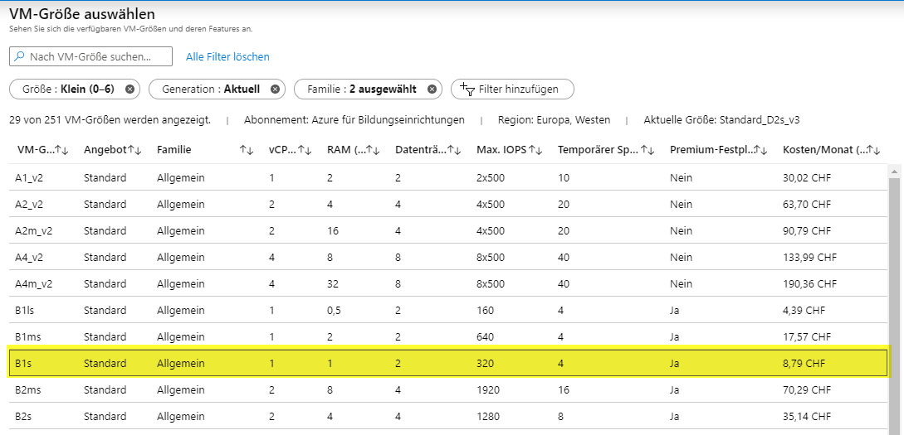
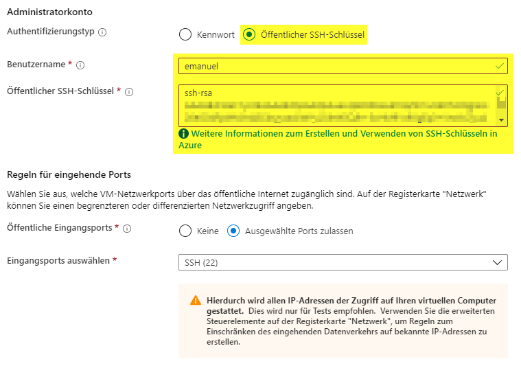
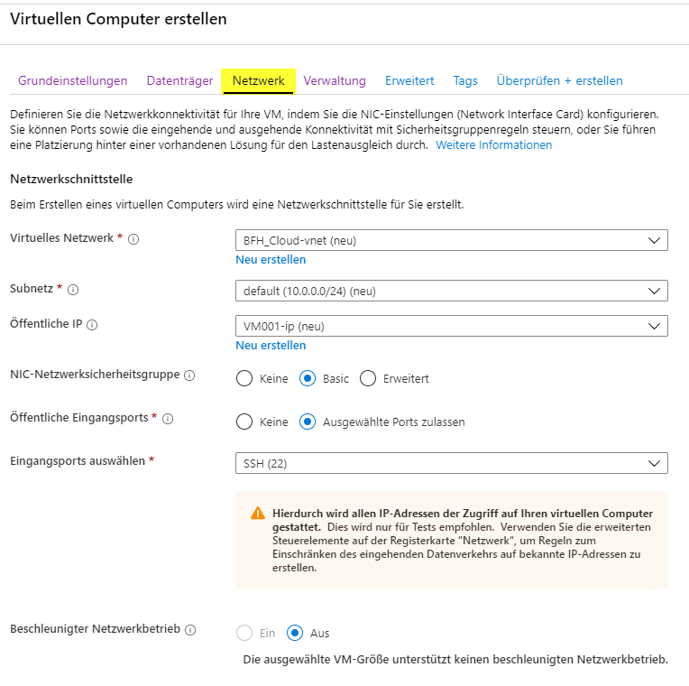
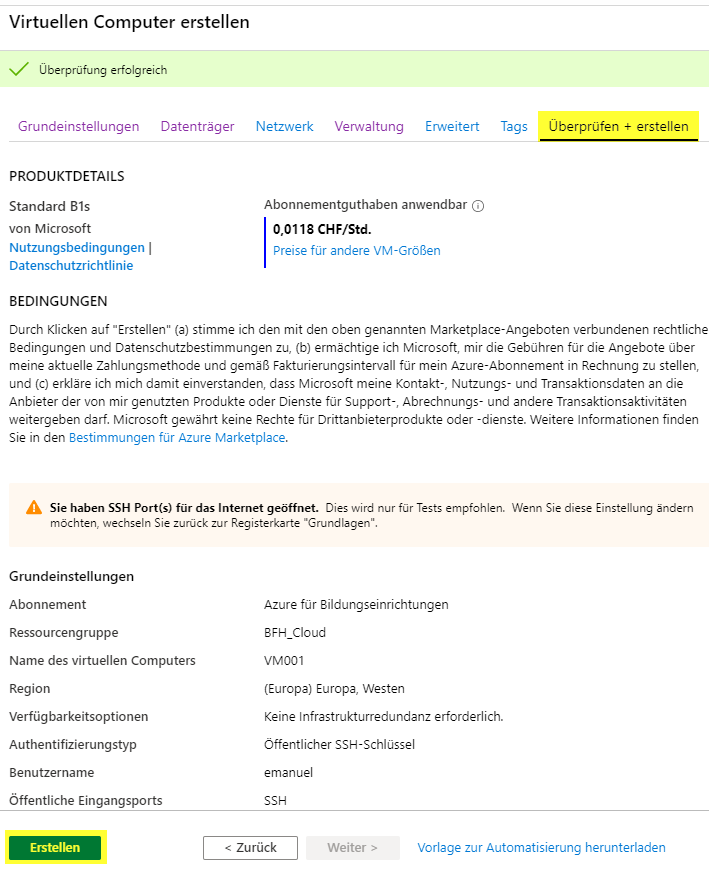

# Azure
Damit eine VM mit Terraform auf der Azure Cloud Plattform installiert werden kann, muss das Azure CLI installiert werden.

## Installation von Azure CLI unter Ubuntu
Installation muss als root durchgeführt werden:
```bash
sudo -i
```
Installation des Pakets:
```bash
apt-get update
```
```bash
apt-get install ca-certificates curl apt-transport-https lsb-release gnupg
```
```bash
curl -sL https://packages.microsoft.com/keys/microsoft.asc | 
    gpg --dearmor | 
    sudo tee /etc/apt/trusted.gpg.d/microsoft.asc.gpg > /dev/null
```
```bash
AZ_REPO=$(lsb_release -cs)
echo "deb [arch=amd64] https://packages.microsoft.com/repos/azure-cli/ $AZ_REPO main" | 
    sudo tee /etc/apt/sources.list.d/azure-cli.list
```
```bash
apt-get update
```
```bash
apt-get install azure-cli
```

## Quelle
https://docs.microsoft.com/bs-cyrl-ba/cli/azure/install-azure-cli-apt?view=azure-cli-latest

## Mit Azure CLI einloggen
```bash
az login <userName>
```

## Billing
Azure stellt für Schüler ein Credit von 100$ zur Verfügung und die verbleibenden Credits können über folgenden Link aufgerufen werden:  
https://www.microsoftazuresponsorships.com/Balance

## Erstellen von Ressourcen über das Azure Portal
**Link zum Azure Portal:**
<br />
https://portal.azure.com/
<br /><br />
Die Erstellung von Azure Ressourcen über das Portal wird anhand einer Ubuntu VM erläutert. Hierbei werden zugehörige Ressourcen, wie öffentliche IP-Adresse, virtuelle Netzwerkkarte etc. automatisch erstellt.  
Vorgehen für die Erstellung:  

1. Auf Portal einloggen und auf "Ressource erstellen" klicken  


2. Unter Beliebt -> Ubuntu auswählen  


3. Danach im Register *Grundeinstellungen* die folgenden Felder ausfüllen. (Ressourcengruppe "BFH_Cloud" muss vorgänig angelegt werden)


4. Bei der Grösse kann eine kostengünstige Variante (hier "Standard B1s") ausgewählt werden.  


5. Als Authentifizierung "Öffentlicher SSH-Schlüssel" auswählen, Benutzernamen eintragen und den public key bei "Öffentlicher SSH-Schlüssel" eintragen.  


6. Ins Register *Netzwerk* wechseln. (Hier können die Standardeinstellungen übernommen werden)  


7. Ins Register *Überprüfen + erstellen* wechseln. Die Grundeinstellungen überprüfen und auf *Erstellen* klicken.


**Hinweis:**  
Die Erstellung aller Ressourcen kann ein paar Minuten dauern und wird mit der Meldung "Ihre Bereitstellung wurde abgeschlossen." bestätigt.  
