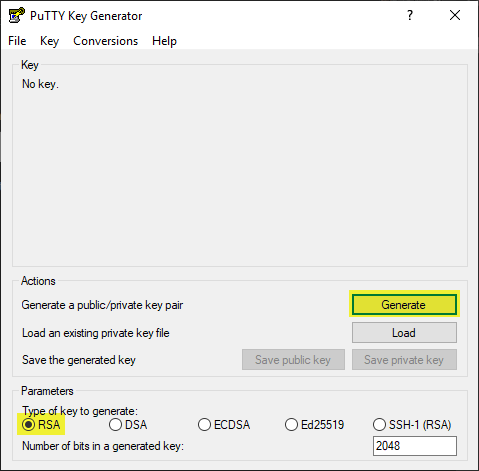
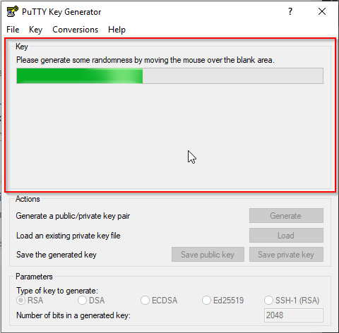
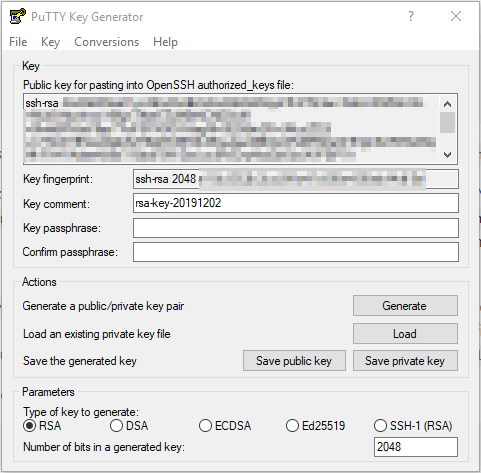

# Generierung von Key Pair
Hier wird beschrieben, wie in den Betriebssystemen Linux (Ubuntu) und Windows ein Schlüsselpaar (Key Pair) generiert werden kann. Dieses Schlüsselpaar kann als Authenzifizierungsmethode bei einer ssh Verbindung dienen.

## Windows - Generierung von Key Pair mit Putty
In Windows kann ein Schlüsselpaar (private und public) mit der Anwendung Putty generiert werden.

Putty kann hier heruntergeladen werden:
https://www.putty.org/

Wenn Putty installiert ist, kann für die Generierung der Schlüssel **PuTTYgen** gestartet werden:


Mit Hilfe von PuTTYgen kann nun folgendermassen ein Schlüsselpaar generiert werden:
1. Als Typ "RSA" auswählen und auf "Generate" klicken  

2. Die Maus im Feld darüber bewegen. Durch die Bewegung der Maus, wird eine Zufälligkeit generiert.  

3. Danach wird der Public Key angezeigt und beide Schlüssel können einzeln gespeichert werden.  

4. Der private Key muss auf jeden Fall mit der Endung .ppk gespeichert und dabei kann zuvor noch durch hinterlegen einer passphrase die Sicherheit erhöht werden.
Beim Öffnen eines private Keys mit PuTTYgen, wird ebenfalls der public Key (selbes Fenster, wie direkt nach Generierung) angezeigt.

## Windows - Generierung von Key Pair mit Linux Subsystem
Damit 

## Linux - Generierung von Key Pair mit ssh-keygen
Für die Erstellung eines Schlüsselpaars unter Linux kann die Command Utility **ssh-keygen** verwendet werden. Dies wird am Beispiel von Ubuntu Schritt für Schritt erläutert.

1. Ausführen von Command zum Erstellen des Schlüsselpaars:  
```bash
ssh-keygen
```
2. Mit Enter bestätigen. (Speichert Schlüsselpaar im Standardpfad des aktuell eingeloggten Users (hier root))
```bash
Enter file in which to save the key (/root/.ssh/id_rsa):
```
3. Hier kann Optional zur erhöhten Sicherheit eine passphrase eingetragen werden. Falls keine passphrase verwendet werden soll, kann einfach mit Enter bestätigt werden.  
```bash
Enter passphrase (empty for no passphrase):
```
4. Hier muss die passphrase zur Überprüfung nochmals eingegeben werden. Falls zuvor keine eingetragen wurden, einfach wieder mit Enter bestätigen.  
```bash
Enter same passphrase again:
```

[← zurück zur Übersicht](../README.md)